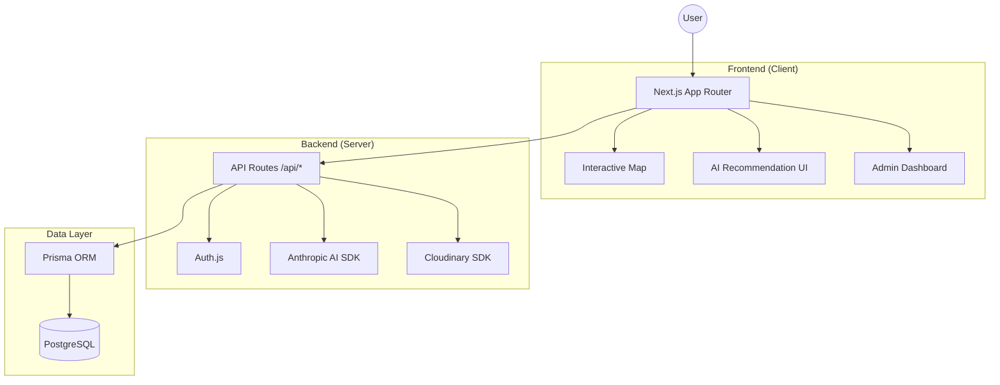
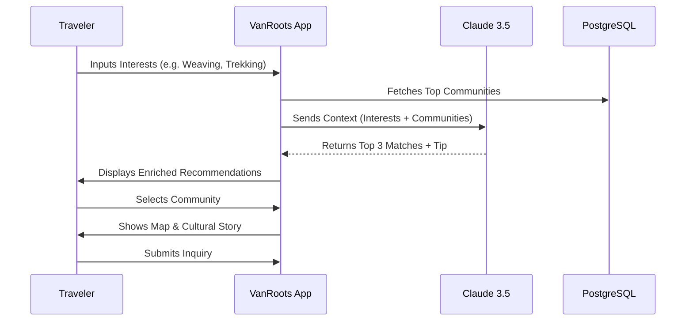

# 🌿 VanRoots: Discover the Soul of Northeast India

VanRoots is a premium, AI-powered eco-cultural travel platform designed to connect conscious travelers with the hidden tribal communities of Northeast India. It bridges the gap between modern exploration and the preservation of indigenous heritage.

---

## 🛠 Tech Stack

- **Framework**: [Next.js 15+](https://nextjs.org/) (App Router)
- **Language**: [TypeScript](https://www.typescriptlang.org/)
- **Styling**: [Tailwind CSS v4](https://tailwindcss.com/)
- **Database**: [PostgreSQL](https://www.postgresql.org/) with [Prisma ORM](https://www.prisma.io/)
- **Authentication**: [Auth.js v5 (NextAuth)](https://authjs.dev/)
- **AI Engine**: [Anthropic Claude 3.5 Sonnet](https://www.anthropic.com/claude)
- **Maps**: [Leaflet](https://leafletjs.org/) & [React Leaflet](https://react-leaflet.js.org/)
- **Media**: [Cloudinary](https://cloudinary.com/) (Next Cloudinary)
- **Editor**: [TipTap](https://tiptap.dev/) (Headless Rich Text Editor)
- **UI Components**: [Shadcn UI](https://ui.shadcn.com/) & [Framer Motion](https://www.framer.com/motion/)

---

## 🚀 Key Features

- **📍 Interactive Community Map**: Explore the 8 North Eastern states via a thematic map with experience-based markers (Eco, Cultural, Culinary, Adventure).
- **🤖 AI Travel Guide**: Get personalized community recommendations based on your interests, group size, and physical level using Claude 3.5 Sonnet.
- **🛂 ILP Guide**: A comprehensive, real-time guide for the Inner Line Permit (ILP) required to enter protected states like Arunachal Pradesh and Nagaland.
- **🛡 Admin Dashboard**: A sophisticated profile editor for community heads to manage their stories, cultural content, and homestay listings.
- **🎭 Cultural Archive**: Rich multimedia storage for beliefs, folklore, and traditional recipes.
- **🔐 Secure Auth**: Multi-role authentication (Traveler, Community Admin, Super Admin) supporting Google OAuth and Credentials.

---

## 🏗 Architecture

VanRoots follows a modern **Monolithic Serverless** architecture using Next.js:



---

## 🔄 User Flow



---

## 📋 Requirements

### Prerequisites
- **Node.js**: v20.x or higher
- **PostgreSQL**: Local instance or hosted (e.g., Supabase/Neon)
- **Cloudinary**: Account for image storage
- **Anthropic API Key**: For AI recommendations

### Environment Variables
Create a `.env` file in the root directory:
```env
# Database
DATABASE_URL="postgresql://..."

# Auth
AUTH_SECRET="your-secret"
AUTH_GOOGLE_ID="your-id"
AUTH_GOOGLE_SECRET="your-secret"

# AI
ANTHROPIC_API_KEY="sk-ant-..."

# Media
CLOUDINARY_CLOUD_NAME="..."
CLOUDINARY_API_KEY="..."
CLOUDINARY_API_SECRET="..."
```

---

## 🛠 Getting Started

1. **Install Dependencies**:
   ```bash
   npm install
   ```

2. **Database Setup**:
   ```bash
   npx prisma generate
   npx prisma db push
   ```

3. **Seed Data**:
   ```bash
   npx prisma db seed
   ```

4. **Run Locally**:
   ```bash
   npm run dev
   ```

---

## 📄 License
This project is licensed under the MIT License.
